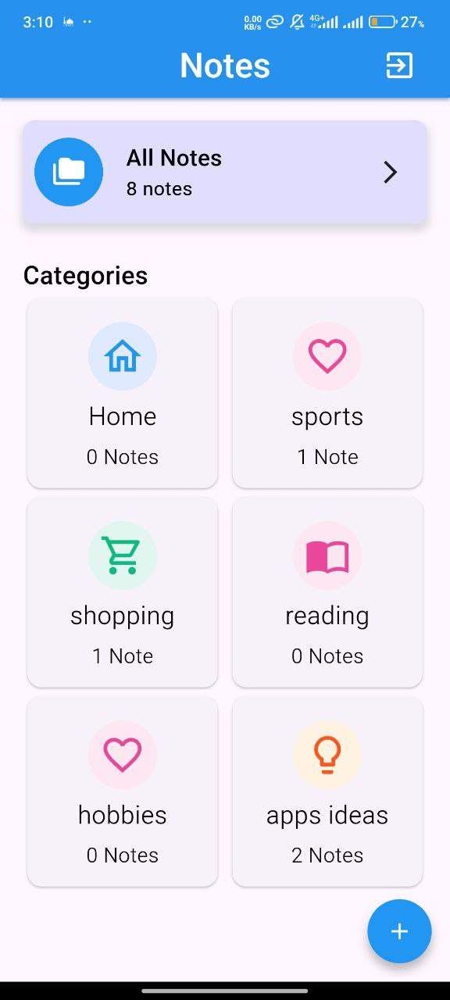
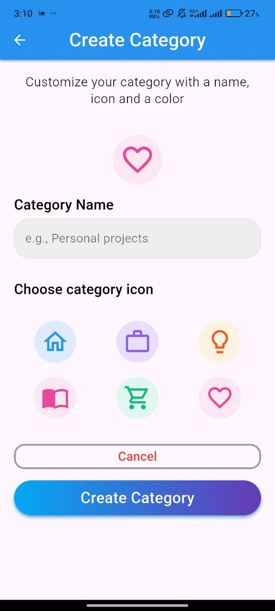
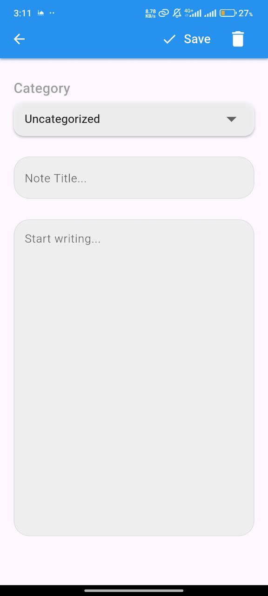
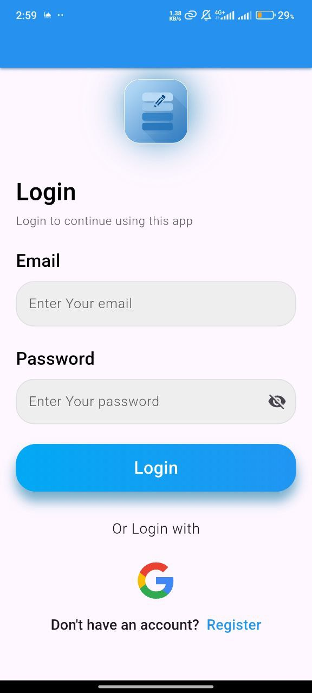

# 📝 My Notes App

A simple and clean notes application built with Flutter that allows users to create notes and organize them into categories. The app uses Supabase as a backend for storing notes and managing authentication.

---

## ✨ Features

- 📝 Create and edit notes
- 🗂️ Organize notes into categories
- ☁️ Cloud storage via Supabase
- 🔐 Secure authentication with Google Sign-In
- ⚡ Fast and responsive UI built with Flutter

---

## 🛠️ Tech Stack

- **Framework:** Flutter & Dart
- **Backend & Database:** Supabase
- **Authentication:** Google Sign-In

---

## 📱 Screenshots

  
  
  
  

---

## 📥 Download

[⬇️ Download APK](https://github.com/YousefAbuHzian/My-Notes-App/releases/download/v1.0.0/app-release.apk)

---

## 📌 About This Repository

This repository showcases the application and its features.
The source code is not publicly available — only the APK and screenshots are provided for demonstration purposes.

---

## 👤 Author

**Yousef Abu Hzian**  
[GitHub](https://github.com/YousefAbuHzian) · [LinkedIn](https://linkedin.com/in/YousefAbuHzian)
